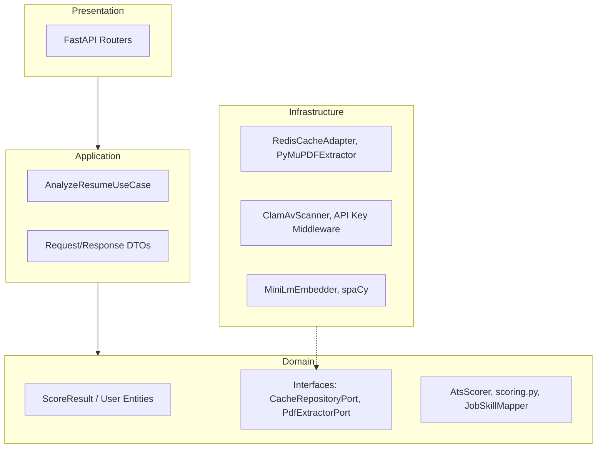

# ResumeRank Pro: Ultimate Viva Preparation & Technical Guide

Welcome to the comprehensive technical guide for **ResumeRank Pro** (ATS Resume Analyzer). This document details every layer of the system—from frontend to cloud infrastructure—explaining the architectural decisions, code designs, ATS scoring algorithms, security measures, and provides key Viva questions to ensure you ace your presentation.

---

## 1. Technological Stack Overview

### **Frontend Frameworks & Libraries**
#### **Web Dashboard (React)**
- **Core Library**: **React (v19.2)** - Enables modular component architecture, virtual DOM updates, and clean hooks-based state management.
- **Build Tool**: **Vite (v8.0)** - Selected over Create React App (CRA) for its blazing-fast Hot Module Replacement (HMR) powered by native ES modules.
- **Styling**: Premium Glassmomorphic Dark UI styled via **Vanilla CSS** for performance, responsiveness, and control.
- **Data Visualization**: Customized CSS progress rings, dynamic layouts, and custom chart components mapping score breakdowns.

#### **Mobile Application (Flutter & Dart)**
- **Cross-Platform Engine**: **Flutter SDK (v3.19.0)** - Renders high-fidelity, native interfaces using Dart.
- **State Management**: **Flutter BLoC (Business Logic Component)** & **Provider** - BLoC ensures strict separation of UI from business logic using streams, making the app highly predictable and testable.
- **Local Storage (NoSQL)**: **Hive & Hive Flutter** - A lightweight, ultra-fast key-value database written in pure Dart, used to store analyzed resume history, session tokens, and user settings.
- **Animations & Micro-interactions**: **Flutter Animate** & **Lottie** - Provides premium, fluid UI micro-animations and physics-based interactions.
- **Visualizations**: **FL Chart** - Renders beautiful interactive radar charts for skill categories and bar graphs for metric tracking.
- **Security**: **Flutter Secure Storage** - Encrypts and securely stores sensitive data (like API tokens) using Keychain (iOS) and Keystore (Android).

---

### **Backend Framework & Languages**
- **Core Language**: **Python 3.11** - Selected for its rich ecosystem of Machine Learning and Natural Language Processing libraries.
- **Web Framework**: **FastAPI** - A modern, high-performance, asynchronous web framework.
  - *Why FastAPI?* Native support for asynchronous processing (`async/await`), automatic OpenAPI/Swagger documentation generation, and high throughput comparable to NodeJS and Go (powered by **Uvicorn** and **Starlette**).
- **Asynchronous Execution**: **Uvicorn** (ASGI server) running concurrent request loops, coupled with Python's `asyncio` for non-blocking I/O operations.

---

### **Databases & Caching**
- **Relational DB**: **SQLite** (local development: `resume_rank.db`) integrated via **SQLAlchemy ORM**.
  - *Database Schema*:
    - **`users`**: Manages profile fields, target salary, experience and education JSON blocks, and hashed passwords.
    - **`history_items`**: Tracks individual resume evaluations, stores overall scores, missing keywords, and full JSON payloads.
    - **`job_applications`**: Implements a mini-ATS system tracker for users (companies applied to, application status, applied dates, and notes).
  - *PostgreSQL Support*: Fully prepared for production via SQLALchemy's database dialer and the `psycopg2-binary` package.
- **Distributed Cache**: **Redis (v7.0)** - Caches resume-JD pair score reports using SHA-256 hashes of the files as cache keys. This prevents redundant ML embeddings and database lookups, lowering costs and latency.
- **Serialization**: **Orjson** - An extremely fast JSON library used to serialize and deserialize cached structures in Redis.

---

### **Artificial Intelligence & NLP Pipeline**
- **Natural Language Processing (NLP)**: **spaCy (`en_core_web_sm`)** - Used for rule-based parsing, part-of-speech (POS) tagging, and noun chunk extraction.
- **Semantic Text Embeddings**: **Sentence-Transformers (Hugging Face / PyTorch)** - Loaded with the `all-MiniLM-L6-v2` model. It converts plain text resumes and JDs into dense 384-dimensional vector spaces.
- **Vector Math**: **NumPy** - Computes the cosine similarity (dot product of L2-normalized vectors) between the resume vector and the job description vector to gauge holistic relevance.
- **Vector Search Engine**: **FAISS (Facebook AI Similarity Search)** - Installed (`faiss-cpu`) to enable fast indexing and clustering of high-dimensional vectors for semantic matching.
- **External Web Scraping**: **Jina AI Reader API (`https://r.jina.ai/{url}`)** - Used dynamically to scrape full-text job descriptions from external non-gated job links, converting them into clean Markdown for parsing.
- **Generative AI Integration**: **Groq API Client** - Connected to LLaMA models to generate hyper-realistic resume improvements, outreach emails, cover letters, and witty persona roasts.

---

### **Deployment & Cloud Infrastructure (GCP & Terraform)**
The production environment is provisioned as an enterprise-grade cloud architecture on **Google Cloud Platform (GCP)** using **Terraform (Infrastructure-as-Code)**:
1. **Google Cloud Run**: Hosts the containerized FastAPI backend. Configured with a minimum instance count of 1 (avoids cold starts) and up to 10 instances, running on 2 CPUs and 2GB RAM.
2. **Google Cloud Memorystore (Redis)**: High-availability private Redis instance configured inside a VPC subnet, serving as the production caching engine.
3. **Google Secret Manager**: Safely stores production secrets, injecting them dynamically into Cloud Run environment variables (API keys, Redis URLs, etc.) at runtime.
4. **Google Cloud Load Balancer (HTTP/HTTPS)**: Standard Load Balancer managing SSL/TLS termination using GCP Managed Certificates, ensuring secure, encrypted transit with automatic HTTP-to-HTTPS redirection.
5. **Google Cloud Storage (GCS)**: Securely stores the remote Terraform state file.

---

### **CI/CD Pipeline (GitHub Actions)**
A robust automated CI/CD pipeline (`ci.yml`) triggers on pushes to `main` and `develop`:
- **Code Quality**: Runs `ruff check`, `ruff format --check`, and strict type checks via `mypy`.
- **Backend Testing**: Spins up real Redis and ClamAV containers in the runner, executing unit and integration tests with **Pytest**.
  - **SLA & Coverage Policy**: Enforces a strict minimum of **95% code coverage** (`--cov-fail-under=95`) and executes latency benchmarks.
- **Flutter Testing**: Installs Flutter, runs `flutter analyze` with zero warning tolerance, and executes unit/widget tests.
- **Docker Validation**: Builds a secure, minimal **distroless** Docker image (ensuring file size is `< 150MB` for rapid deployments) and scans it for vulnerabilities using **Trivy**.
- **Secure GCP Deployment**: Authenticates using **Workload Identity Federation (WIF)**, eliminating the need to store raw service account JSON credentials in GitHub secrets. Deploys the built container to Cloud Run, concluding with an automated endpoint health check.

---

## 2. Main Logic & Architecture (Domain-Driven Design)

The backend follows a **Hexagonal / Clean Architecture** organized into Domain-Driven Design (DDD) layers:



### **The Request-Response Lifecycle**
1. **API Gateway / Middleware**: The client hits the `/v1/analyze` route sending a PDF file and JD text. The route is authenticated via `verify_api_key` middleware.
2. **Malware Scan**: The file bytes are sent to **ClamAV** (using socket communication via `clamd`) to scan for malicious payloads. If infected, the request is rejected immediately.
3. **Job Description Validation**: The system uses `JobDescriptionValidator` (verifies JD text length, keyword distributions, and indicators) to ensure the user didn't paste gibberish.
4. **Cache Lookup**: Computes SHA-256 hashes of the PDF bytes and JD text. These are combined into a cache key to query Redis. If a match is found (Cache Hit), it returns the scoring report in `< 5ms`.
5. **Text Extraction**: If cache misses, the backend uses **PyMuPDF (`fitz`)** (or fallbacks to `pdfminer`/`pdfplumber`) to extract raw text blocks.
6. **Resume Validation**: Checks the extracted text against `ResumeValidator` (looks for section headers like education, work, skills) to confirm the uploaded file is indeed a resume.
7. **Semantic Embeddings**: The text is passed to `MiniLmEmbedder` to generate dense vector representation for the resume and JD.
8. **Scoring Engine**: Runs the core mathematical scoring rules (`scoring.py` + `AtsScorer`) merging NLP, semantic similarity, formatting heuristics, and parsing limits into a cohesive rating.
9. **Generative Processing**: Generates tailored resume improvements, outreach emails, cover letters, and a roast.
10. **Cache Write & Response**: Saves the compiled response in Redis and returns it to the caller.

---

## 3. ATS Score Breakdown & Calculation Heuristics

The overall score is a weighted score out of 100, composed of four specialized pillars:

$$\text{Overall Score} = (\text{Keywords} \times 0.40) + (\text{Semantic Relevance} \times 0.15) + (\text{Impact} \times 0.25) + (\text{Formatting/Tone} \times 0.20)$$

```
┌────────────────────────────────────────────────────────────────────────┐
│                          OVERALL ATS SCORE (100)                       │
├───────────────┬────────────────────────┬───────────────┬───────────────┤
│ Keyword Match │   Semantic Relevance   │ Resume Impact │  Format/Tone  │
│     (40%)     │         (15%)          │     (25%)     │     (20%)     │
└───────────────┴────────────────────────┴───────────────┴───────────────┘
```

Here is exactly how each section is computed programmatically inside `scoring.py` and `ats_scorer.py`:

### **1. Keyword & Skill Match (40% Weight)**
Tracks technical and soft skills requested in the Job Description against the resume content.
* **Extraction**: Programmatically extracts nouns and proper nouns from the JD, filtering out common stopwords (like "years", "qualification"). It maps them against a **`SKILLS_WHITELIST`** (e.g., Python, Docker, AWS).
* **Point Allocation Rules (Per Skill Match)**:
  - **Exact/Flexible Match (10 Points)**: RegEx matching of base words (e.g., "React" matches "reactjs", "react").
  - **Synonym/Alias Match (7 Points)**: Resolves synonyms via a pre-mapped dictionary (e.g., if JD requests "AWS", matches "ec2", "s3", or "amazon web services").
  - **Hybrid Semantic Match (6 Points)**: Compares spaCy noun chunks. Bridges lexical gaps (e.g., if the resume says "React Native Architecture" and the JD requests "React").
  - **Partial/Sub-word Match (4 Points)**: Matches parts of multi-word skills (e.g., matching "System" in "System Design").
* **Scoring Formula**:
  $$\text{Keyword Score Raw} = \min\left(100, \frac{\sum (\text{Skill Weight} \times \text{Boost})}{\sum \text{JD Skill Weight}} \times 100\right)$$
  The raw score is then scaled through an **S-curve** (raising it to the power of 0.8) to differentiate between average alignment and exceptional matches, mapping 50% match to ~60 and 80% to ~90.

### **2. Semantic Relevance (15% Weight)**
Evaluates the holistic conceptual overlap between the resume and the job description, capturing meaning rather than exact keywords.
* **Logic**: Employs `MiniLmEmbedder` to generate 384-dimensional dense vectors of the texts.
* **Math**: Computes the dot product of the L2-normalized vectors (Cosine Similarity).
* **Broad Range Mapping**: Raw cosine similarity values usually fall between `0.5` and `0.8`. The engine scales this using a non-linear S-curve:
  $$\text{Semantic Mapped} = (\text{Cosine Similarity})^{1.5} \times 100$$
  If the value exceeds 0.4, it is scaled by 1.3 (capped at 100) to ensure accurate distribution.

### **3. Content Impact Quality (25% Weight)**
Measures how effectively you communicate achievements instead of just listing responsibilities.
* **Action Verbs (30% of Impact)**: Scans for high-impact verbs (e.g., *spearheaded, engineered, optimized, launched*). Awards **6 points per unique verb** (up to 30 points).
* **Quantified Results (45% of Impact)**: Scans for metrics, currency signs, percentages, and numerical keywords (e.g., *₹1.2M, 40%, 15 clients*). Awards **15 points per unique metric** (up to 45 points).
* **Power Words (25% of Impact)**: Checks for credentials and excellence indicators (e.g., *expert, certified, promoted, exceeded*). Awards **5 points per word** (up to 25 points).
* **Calculation**: Sums verbs + metrics + power words (caps at 100). Passive language (like *"responsible for"*, *"assisted"*) decreases the score ratio.

### **4. Formatting & Technical Parsability (20% Weight)**
Evaluates whether the resume's layout is optimized for parsing by standard Applicant Tracking Systems.
* **Base Score**: 100 points, subject to structural deductions:
  - **Tables Detection (-25 Points)**: Tables confuse older ATS parsers, making text unreadable.
  - **Multi-Column Layouts (-15 Points)**: ATS parsers read left-to-right across columns, jumbling sentences.
  - **Low Text Density (-15 Points)**: Extracted text `< 500` characters indicates an image-only PDF.
  - **Excessive Images/Graphics (-10 Points)**: Deducted if there are more than 2 embedded images.
  - **Tiny Font Size (-10 Points)**: Triggers if text font size falls below `8.5pt`.
  - **Section Integrity**: Scans for the presence of 5 core sections: *Experience, Education, Skills, Contact, Summary* (awards 20 points per section present).
  - **Special Character Penalties (-30 Points)**: Penalizes resumes with excessive bullet symbols or non-ASCII characters that break text decoders.

---

## 4. Advanced SaaS Features

ResumeRank Pro goes beyond analysis to provide a full career advancement dashboard:
1. **Career Accelerator**:
   - **LinkedIn Outreach & Cold Email Drafts**: Generates outreach messages tailored to your candidate persona (e.g., "The Bold" or "The Professional").
   - **Negotiation Scripts**: Drafts scripts for salary discussions based on your target range.
   - **Culture Bio Ghostwriter**: Writes a short bio mapping your profile to the target company's culture.
   - **Intelligent Gap Projects**: Identifies missing skills and designs practical developer projects to help you learn them.
2. **AI Resume Enhancer (Cover Letter & Rewrites)**: Generates a complete cover letter linking your top skills to the company's job description.
3. **Plagiarism & Authenticity Check**: Scans for over-optimization and copy-pasted job description text to prevent your resume from being flagged by ATS spam filters.
4. **"Roast My Resume"**: Generates a witty, personality-driven critique of your resume based on your detected professional persona.

---

## 5. Potential Viva Questions & Answers

### **Q1: Why did you choose FastAPI over Flask or Django?**
* **Answer**: "We chose FastAPI for three primary reasons:
  1. **Asynchronous Support**: Python's native `async/await` allows the backend to handle high-concurrency requests—like file uploads and network-based ML calls—without blocking the thread pool.
  2. **Speed**: Built on Starlette and Uvicorn, FastAPI matches the performance of Go and NodeJS, outperforming traditional WSGI frameworks like Flask.
  3. **Auto-Documentation**: It integrates Swagger UI and ReDoc out-of-the-box using Pydantic schemas, reducing development time."

### **Q2: How does the PDF extraction work, and how do you handle scanned image PDFs?**
* **Answer**: "We use **PyMuPDF (`fitz`)** as our primary text extractor because of its high speed and parsing accuracy. If PyMuPDF encounters extraction issues, the system falls back to `pdfminer.six` and `pdfplumber`. To handle scanned image PDFs, the system evaluates the extracted text density. If the text count is less than 500 characters, it flags a warning suggesting the user upload a text-searchable PDF. For production scaling, we can integrate an OCR engine like Tesseract."

### **Q3: What Machine Learning model is used for semantic similarity, and why not use OpenAI/Gemini for scoring?**
* **Answer**: "We use the **`all-MiniLM-L6-v2`** model from the `sentence-transformers` library, which we host locally. It encodes text into 384-dimensional vectors. We avoided using LLM APIs like OpenAI or Gemini for core scoring due to three main factors:
  1. **Determinism**: LLM outputs can vary, whereas our local vector math is consistent and predictable.
  2. **Latency**: API calls can take seconds, while our local model calculates embeddings in milliseconds.
  3. **Cost & Rate Limits**: Local deployment eliminates API cost scaling issues. We restrict our use of LLMs (via Groq) to generative tasks like cover letters and rewrites."

### **Q4: How does the system handle redundant processing of identical resumes and job descriptions?**
* **Answer**: "We implement a high-performance caching layer using **Redis**. When a user uploads a resume and a job description:
  1. We compute the SHA-256 hash of the PDF bytes and the JD text.
  2. We concatenate these hashes to form a unique cache key.
  3. If a match is found in Redis, the system returns the cached scoring report in milliseconds, avoiding the need to rerun PDF extraction, ML embedding, or database operations.
  4. If it's a cache miss, we process the request and store the result in Redis with a time-to-live (TTL) expiration."

### **Q5: Why did you implement a malware scanner like ClamAV?**
* **Answer**: "Allowing public users to upload PDF files poses a security risk, as PDFs can contain embedded malware, script exploits, or macro viruses. To secure the server, we run a **ClamAV** container. Before parsing any uploaded file, we stream the bytes to ClamAV via a TCP socket. If it detects a threat, the request is rejected with a `400 Bad Request` before the PDF parser runs."

### **Q6: Explain your database choice. Why SQLite locally and how do you deploy in production?**
* **Answer**: "For development, we use **SQLite** because it is self-contained, serverless, and requires zero configuration. We access it using **SQLAlchemy ORM**. Because SQLAlchemy abstracts our database operations, we can transition to a production database like **PostgreSQL** in our Cloud Run environment simply by updating the database URL environment variable, requiring no changes to our application code."

### **Q7: What is Workload Identity Federation (WIF) in your CI/CD pipeline?**
* **Answer**: "Workload Identity Federation is a secure authentication mechanism that lets GitHub Actions access Google Cloud resources without using long-lived service account keys. It establishes a trust relationship between GitHub and GCP, allowing GitHub to request short-lived access tokens dynamically. This adheres to security best practices by eliminating stored cloud credentials."

### **Q8: How did you implement state management and local storage in Flutter?**
* **Answer**: "We used the **BLoC pattern** for state management, which separates the user interface from business logic. State changes are handled through Events and emitted as States, which the UI listens to. For local storage, we chose **Hive** because it is a lightweight, high-performance key-value database written in Dart. It stores search history and settings directly on the device as binary files, making database operations faster than SQFlite."

### **Q9: If the server takes longer than 10 seconds to score a resume, how does the API handle it?**
* **Answer**: "We use a hybrid **Synchronous/Asynchronous pipeline**. The backend use case sets a timeout of 10 seconds. If the pipeline finishes within this limit, it returns the result immediately. If it times out, the backend returns a `202 Accepted` status code along with a unique `job_id` and a status polling URL (e.g., `/status/{job_id}`). The client can poll this URL in the background while displaying a loading indicator, ensuring a smooth user experience."
